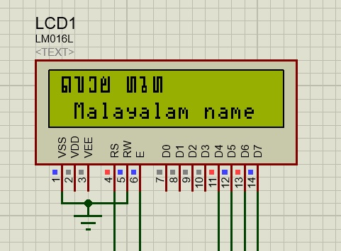

# Interface a 16x2 LCD to PIC16F877A microcontroller and display a Malayalam word

In this Project, you will be learning and conducting a practical experiment on interfacing a 16x2 LCD with PIC16F877A microcontroller and displaying malayalam word (Custom character) in it.

## 16x2 Dot Matrix LCD Controller IC HD44780:

<p align="center">
    
</p>

An LCD (Liquid Crystal Display) screen is a type of electronic display that can be used in a variety of ways. A 16x2 LCD display is a relatively basic module that can be found in a variety of devices and circuits. **A 16x2 LCD can display 16 characters per line on each of its two lines. Each character is presented in a 5x7 pixel matrix on this LCD**. The 224 distinct characters and symbols can be displayed on the 16 x 2 intelligent alphanumeric dot matrix display. Command and Data are the two registers on this LCD

**In order for a custom character to be displayed, the IC has to be informed about the custom character's appearance. To accomplish so, the understanding of the HD44780 LCD controller IC's three types of memory is required:**
   #### 1. Character Generator ROM (CGROM):
   #### 2. Display Data RAM (DDRAM): 
   #### 3. Character generator RAM (CGRAM):
   
<p align="center">
    
</p>

As, the datasheet implies, the HD44780 IC has provided as 8 Locations to store the custom patterns in CGRAM, also on the right, can view that there are some pre-defined characters which can also be displayed on the LCD Screen. **Two create a custom charter byself, Simply put a ‘1’ on the shaded region and a ‘0’ on the un-shaded region for each byte i.e across the 5x7 of each matrix** ( making upto 8 matrix of the 16 characters), and that is it the custom pattern is ready

<p align="center">
    
</p>

## Demo to create a character

Use the app online at https://omerk.github.io/lcdchargen/ or search for options in Google there are many available ( LCD hex generator)

<p align="center">
    
</p>

Now that , we have created the binary for our character, copy and replace them under the function ```const unsigned short Custom_Char5x8[]``` in the code

**NOTE:- Each character binary should be placed in each line, and maximum of eight characters**

## Circuit diagram for Connecting LCD and PIC16f877A

<p align="center">
    
</p>

<p align="center">
    
</p>


## License

The code in this project have been made with references. It is free and open to use for all. And thanks for your valuable time in reading this blog. **Project code and simulation files can be downloaded from the link given below.**

Few references are :

[1. Circuit Digest](https://circuitdigest.com/microcontroller-projects/custom-characters-on-lcd-using-pic16f877a)

[2. Openlabpro](https://openlabpro.com/guide/custom-character-lcd-pic/)

Note that you will be responsible for following terms of service of the third party APIs used in the code. 
<p align="center">
  <b>DOWNLOAD THE PROJECT FOLDER </b><br>
  <a href="https://github.com/Bggopal/Interface-lcd-display-malayalam-words/archive/refs/heads/main.zip">HERE</a> 
  <br><br>
</p>

  

